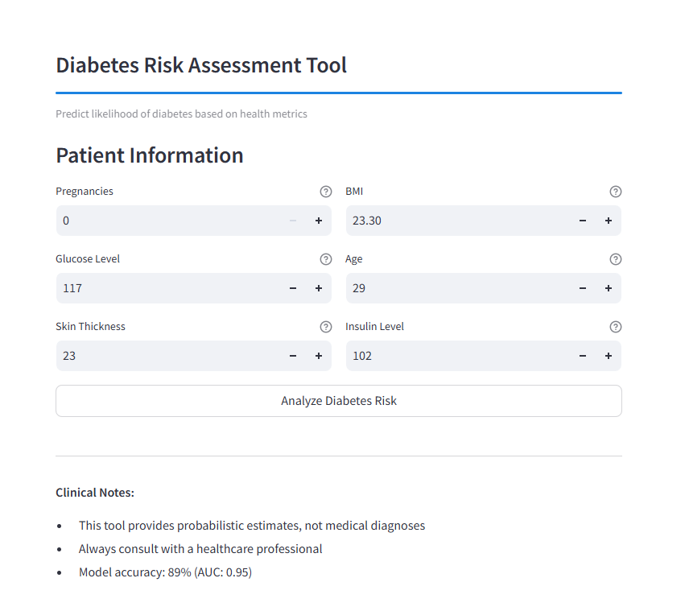
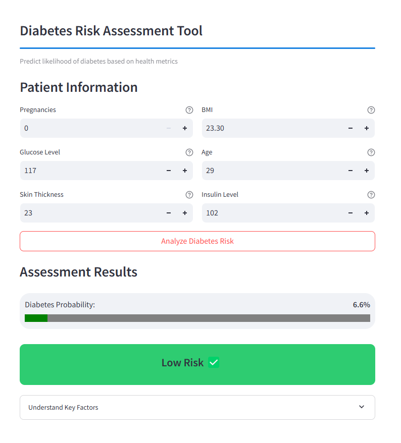
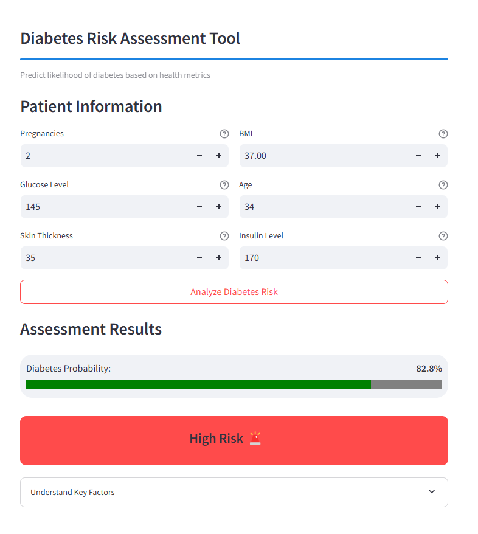

# Diabetes Dataset Analysis and Modeling
## Screenshots

Here are some screenshots from the project:

## 1. Data Loading and Exploratory Analysis

- The dataset was loaded from the `diabetes.csv` file.
- Data types, missing values, and general statistical distributions were examined.
- It was identified that zero values in the `Glucose`, `BloodPressure`, `SkinThickness`, `Insulin`, and `BMI` variables could be considered as missing data.

## 2. Data Visualization

- Histograms were used to examine the distributions of variables.
- Boxplots were utilized to analyze the distribution of independent variables based on the `Outcome` variable.

## 3. Handling Missing Values

- Zero values in the `Glucose`, `BloodPressure`, and `BMI` variables were replaced with the median value of the respective column.
- For `Insulin` and `SkinThickness` variables, median values were computed based on the `Outcome` class and used to fill the missing values.

## 4. Outlier Correction

- Outliers were identified using the Interquartile Range (IQR) method and replaced with lower and upper bounds.

## 5. Modeling

### Modeling with PyCaret

- Classification models were trained using the PyCaret library.

#### Setup Process:

- Data was normalized using z-score normalization.
- Highly correlated features were removed (multicollinearity threshold = 0.95).
- 5-fold cross-validation was applied.
- Necessary transformations (Yeo-Johnson transformation) were applied to numerical variables.

#### Top Three Models:

| Model        | Accuracy | AUC    | Recall  | Precision | F1 Score |
|-------------|----------|--------|---------|-----------|----------|
| LightGBM    | 0.8753   | 0.9458 | 0.7866  | 0.8444    | 0.8136   |
| XGBoost     | 0.8864   | 0.9451 | 0.8026  | 0.8659    | 0.8304   |
| RandomForest| 0.8827   | 0.9417 | 0.8024  | 0.8562    | 0.8270   |

- The best model was determined as **XGBoost**.
- SHAP analysis was conducted to examine feature importance.
- Model hyperparameters were optimized using **Optuna**, and the best model was selected based on the AUC metric.

### Automated Machine Learning with TPOT

- **TPOT (Tree-based Pipeline Optimization Tool)** was used to automatically select the best classification model using genetic algorithms.
- Optimization was performed with **10 generations and a population of 50 individuals**.
- The best model achieved a **ROC-AUC score of 0.9537**.

## 6. Results

- Comprehensive preprocessing steps were applied to the dataset.
- Missing and outlier values were handled effectively.
- Various machine learning models were trained, and **XGBoost** was identified as the best model.
- **TPOT** was used for automated model selection, improving the **ROC-AUC score**.

## Future Work

- Feature engineering can be applied to enhance model performance.
- The model's generalization ability can be tested with a larger dataset.
- Deep learning approaches (ANN, CNN) can be explored and compared with current results.

